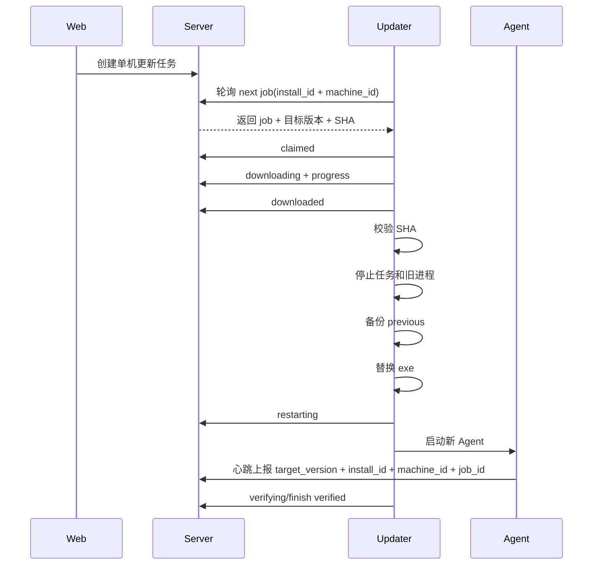

# Agent 后台推送更新架构计划书

> 目标版本线：从 `0.57.3` 之后开始重构更新链路。  
> 适用范围：Windows 被控端 Agent、服务端更新 API、Web 更新控制界面、安装器。  
> 目标：首次安装后，后续 Agent 可以在后台稳定拉取更新；支持单机灰度、失败回滚、状态可见、问题可诊断。

---

## 1. 背景和问题结论

今天 `0.57 -> 0.57.2 -> 0.57.3` 的更新测试没有稳定成功，根因不是单个下载慢或网络问题，而是当前更新架构存在自举缺口：

1. **旧 Agent 负责拉取新 Agent，并负责启动 updater。**  
   如果旧 Agent 的更新逻辑本身有 bug，新版本修复无法生效，因为它还没有被安装到机器上。

2. **updater 不是长期独立组件。**  
   现在 `updater.ps1` 跟 Agent 放在同一个安装目录，主要由 Agent 触发。Agent 卡住、重复进程、任务被禁用、旧脚本没启动时，更新流程没有第二条可靠路径接管。

3. **服务端只有“允许更新”字段，没有完整更新任务。**  
   当前服务端主要保存 `update_allowed_version`、`update_status`、`update_error` 等字段，缺少 job_id、阶段时间、下载进度、重试次数、updater 心跳、超时判定和日志回传。

4. **Web 展示容易显示旧状态。**  
   当 Agent 离线、进程不存在、任务不存在时，服务端仍可能保留 `downloading/installing` 这类历史状态，用户看到“安装中”，但本机已经没有实际更新进程。

5. **安装包缓存和版本文件名曾经干扰判断。**  
   如果浏览器或中间层拿到旧安装包，用户以为安装了新版本，实际运行的是旧版本。后续必须继续坚持版本化下载地址、版本化文件名、SHA256 校验和 no-cache。

结论：后续不能继续把更新能力完全寄托在当前运行的 Agent 进程里。需要一个“首次安装就固定下来的独立更新器”，由它负责后台拉取、停止 Agent、替换文件、重启、验证和回滚。

---

## 2. 设计目标

### 2.1 必须做到

- 明确区分“已经坏掉的旧 Agent 恢复”和“新架构下的后台更新”，不能把两者混成一个状态。
- 首次安装完成后，后续更新不需要运维人员手动复制文件。
- 支持 Web 对单台 Agent 发起允许更新。
- 默认一次只更新一台机器，适配当前多台被控机冗余部署。
- 旧版本下载完成后必须校验 SHA256。
- 替换前必须备份当前可运行版本。
- 新版本启动失败或超时不上报，必须回滚到 previous。
- Web 必须展示当前版本、目标版本、允许版本、更新阶段、失败原因、最近日志。
- 更新卡住超过阈值时，服务端必须自动标记失败，不能无限显示“安装中”。
- Agent 主程序仍然运行在用户桌面会话中，不能改成普通 Session 0 Windows Service。
- 更新任务必须以 `install_id + machine_id` 绑定机器，`agent_name` 只作为显示名。
- 新版本成功必须由目标机器、目标安装实例、目标版本、目标时间之后的心跳共同证明。

### 2.2 暂不追求

- 暂不做全量批量自动滚动升级。
- 暂不做跨服务器 CDN 分发。
- 暂不做增量补丁包。
- 暂不做复杂权限域管理。

---

## 3. 总体架构

新的更新链路拆成四层：


### 3.1 Agent 主程序

职责收窄：

- 继续负责截图、活动记录、浏览器历史、运行状态上报。
- 上报 `agent_version`、`install_id`、`updater_version`、`control_status`。
- 可以展示“我看到了更新任务”，但不再负责核心替换流程。
- 不再由 Agent 自己杀自己、替换自己。

### 3.2 独立 Updater

首次安装时写入 `C:\ProgramData\GameFrameRateViewer\updater\`，由计划任务单独启动。

Updater 需要再拆成两层：

- **Bootstrap Runner：** 极小、稳定、尽量不改的启动器。计划任务永远指向它。它负责读取配置、校验 updater 文件、必要时替换 updater，再启动 updater。
- **Updater：** 负责轮询任务、下载、安装、回滚和日志上报。Updater 可以升级，但不能直接替换正在运行的 Runner。

这样做是为了避免“updater 自己也坏了，无法更新自己”的二次自举问题。

职责：

- 定时轮询服务端是否有属于本机的更新任务。
- 下载版本包到本机缓存目录。
- 校验 SHA256 和文件大小。
- 停止 Agent 主任务和 watchdog 任务。
- 停止旧 Agent 进程。
- 备份旧 exe、脚本和配置快照。
- 原子替换新版本文件。
- 重新启用任务并启动 Agent。
- 等待服务端看到目标版本心跳。
- 成功则标记 `verified`，失败则回滚并标记 `rolled_back/failed`。

### 3.2.1 计划任务矩阵

| 任务 | 运行身份 | 触发器 | 交互桌面 | 最高权限 | 作用 |
|------|----------|--------|----------|----------|------|
| `GameFrameRateViewer` | 当前安装用户 | 用户登录 `ONLOGON` | 需要 `/IT` | `/RL HIGHEST` | 启动桌面会话 Agent |
| `GameFrameRateViewer Watchdog` | 当前安装用户 | 每 1 分钟 | 需要 `/IT` | `/RL HIGHEST` | 登录会话内守护 Agent |
| `GameFrameRateViewer Updater` | `SYSTEM` | 系统启动后延迟触发 + 每 1-5 分钟 | 不使用 `/IT`，不依赖交互桌面 | `/RL HIGHEST` | 启动 Runner，处理下载/替换/回滚 |

规则：

- Agent 和 Watchdog 必须进入用户桌面会话，否则截图、活动窗口、键盘监听会失效。
- Updater 推荐固定为 `SYSTEM` 后台任务，负责下载、校验、替换、回滚、启停计划任务，但不能直接把 Agent 启动到 Session 0。
- 如果没有可用桌面会话，Updater 替换完成后进入 `waiting_login` 或 `restarting`，等待用户登录后由 `ONLOGON` 任务启动 Agent，再进入验证。
- 如果存在已登录的安装用户会话，Updater 也只能通过 `GameFrameRateViewer` 交互计划任务或 `run-hidden.vbs` 的用户会话入口启动 Agent，不能用 SYSTEM 直接 `Start-Process` 主程序。
- Updater 不应该依赖旧 Agent 存活；即使 Agent 被杀掉，Updater 任务仍要能轮询服务端。
- Watchdog 在 `installing` 阶段必须被禁用或识别安装锁，不能在替换过程中重新拉起旧 Agent。

### 3.3 Server

职责：

- 管理版本元数据。
- 管理每台机器的更新任务。
- 提供下载接口。
- 接收 Agent 心跳和 Updater 心跳。
- 根据阶段时间做超时失败判定。
- 给 Web 提供可读状态和日志。

### 3.4 Web

职责：

- 展示版本和更新状态。
- 对单台 Agent 发起允许更新。
- 禁止同时更新多台，除非后续显式打开批量策略。
- 展示失败原因、最近日志、是否可重试。

---

## 4. 本机安装目录建议

```text
C:\ProgramData\GameFrameRateViewer\
  GameFrameRateViewer.exe
  config.json
  run-hidden.vbs
  watchdog.vbs
  updater\
    GameFrameRateRunner.exe 或 runner.ps1
    GameFrameRateUpdater.exe 或 updater.ps1
    updater-config.json
  downloads\
    GameFrameRateViewer-0.58.0.exe
  previous\
    0.57.3\
      GameFrameRateViewer.exe
      updater.ps1
      config.json
  logs\
    updater.log
    update-state.json
```

说明：

- `updater` 目录和 Agent 主程序分开，避免替换 Agent 时影响 updater。
- 计划任务只指向 Runner；Updater 可以被 Runner 校验后替换。
- `downloads` 保留已下载包，SHA 匹配时可跳过重复下载。
- `previous` 按版本保存回滚文件。
- `logs` 是本机诊断来源，必要时由 updater 摘要上报到服务端。

---

## 5. 更新状态机

### 5.1 服务端任务状态

| 状态 | 含义 | 谁写入 |
|------|------|--------|
| `pending` | Web 已创建任务，等待本机 updater 拉取 | Server |
| `claimed` | updater 已领取任务 | Updater |
| `downloading` | 正在下载更新包 | Updater |
| `downloaded` | 下载完成并校验通过 | Updater |
| `installing` | 正在停止旧 Agent 并替换文件 | Updater |
| `restarting` | 文件替换完成，正在启动新 Agent | Updater |
| `waiting_login` | 文件已替换，但当前没有桌面会话，等待用户登录启动 Agent | Updater/Server |
| `verifying` | 等待服务端看到目标版本心跳 | Updater |
| `verified` | 新版本心跳成功，更新完成 | Server/Updater |
| `failed` | 更新失败，未完成替换或无法继续 | Updater/Server |
| `rolled_back_verified` | 替换后失败，已恢复旧版本且旧版本心跳已验证 | Updater/Server |
| `rolled_back_unverified` | 替换后失败，已尝试恢复旧版本但尚未验证旧版本心跳 | Updater/Server |
| `canceled` | Web 人工取消，尚未进入不可中断阶段 | Server |
| `stale` | 超时未推进，由服务端判定为卡住 | Server |

### 5.2 不可中断阶段

进入 `installing` 后不允许简单取消，只能等待成功、失败或回滚。Web 的“暂停”只是不再下发新任务，不能强行打断正在替换文件的 updater。

### 5.3 超时规则

建议默认阈值：

| 阶段 | 超时 |
|------|------|
| `pending` | 不超时，离线机器可以等待上线 |
| `claimed` | 2 分钟 |
| `downloading` | 20 分钟，且必须有下载进度变化 |
| `downloaded` | 5 分钟 |
| `installing` | 3 分钟 |
| `restarting` | 2 分钟 |
| `waiting_login` | 不按安装失败处理，但 Web 必须显示“等待用户登录验证” |
| `verifying` | 3 分钟 |

超时后服务端标记 `stale/failed`，Web 显示“更新卡住”，并保留最近阶段、最近日志、最后 updater 心跳时间。

---

## 6. 数据结构设计

### 6.1 agent_versions

保存可发布版本，而不是只用代码里的常量。

| 字段 | 说明 |
|------|------|
| `id` | 主键 |
| `version` | 版本号，例如 `0.58.0` |
| `channel` | `stable` / `canary` |
| `exe_path` | Agent exe 文件路径 |
| `setup_path` | 安装器文件路径 |
| `exe_sha256` | exe SHA256 |
| `setup_sha256` | 安装器 SHA256 |
| `exe_size_bytes` | exe 大小 |
| `setup_size_bytes` | 安装器大小 |
| `updater_version` | 该版本要求的 updater 最低版本 |
| `release_notes` | 更新说明 |
| `created_at` | 发布时间 |
| `is_active` | 是否当前可用 |

### 6.2 agent_update_jobs

每次点击“允许更新”创建一条任务。

| 字段 | 说明 |
|------|------|
| `id` | 主键 |
| `job_id` | 对外任务 ID |
| `install_id` | 首次安装生成的安装实例 ID，更新主键之一 |
| `machine_id` | 机器唯一 ID，防止重名误更新 |
| `agent_name` | 目标 Agent 显示名，不作为唯一更新主键 |
| `from_version` | 创建任务时的当前版本 |
| `target_version` | 目标版本 |
| `status` | 状态机状态 |
| `progress_bytes` | 已下载字节 |
| `total_bytes` | 总字节 |
| `attempt_count` | 重试次数 |
| `last_error` | 最近错误 |
| `last_log` | 最近日志摘要 |
| `claimed_at` | updater 领取时间 |
| `updated_at` | 最近状态变更 |
| `created_at` | 创建时间 |
| `finished_at` | 完成时间 |

约束：

- 同一 `install_id + machine_id` 同时只能有一个未完成 job。
- 全局默认同时只能有一个 active job。
- `agent_name` 允许修改或合并，不允许作为更新任务的唯一定位依据。

### 6.3 agent_update_events

保存更新过程事件，方便排查。

| 字段 | 说明 |
|------|------|
| `id` | 主键 |
| `job_id` | 所属任务 |
| `agent_name` | 目标 Agent |
| `level` | `INFO` / `WARNING` / `ERROR` |
| `stage` | 当前阶段 |
| `message` | 日志文本 |
| `created_at` | 时间 |

---

## 7. API 设计

### 7.1 Web 管理接口

| 方法 | 路径 | 说明 |
|------|------|------|
| `GET` | `/api/agent/versions` | 版本列表 |
| `GET` | `/api/agent/versions/latest` | 当前稳定版本 |
| `POST` | `/api/agents/{agent}/update/jobs` | 为单台 Agent 创建更新任务，内部必须绑定 `install_id + machine_id` |
| `GET` | `/api/agents/{agent}/update/jobs/latest` | 查询该 Agent 最新任务，返回 job 状态优先级高于旧 agents 字段 |
| `POST` | `/api/agents/{agent}/update/jobs/{job_id}/cancel` | 取消未进入安装阶段的任务 |
| `POST` | `/api/agents/{agent}/update/jobs/{job_id}/retry` | 基于同一目标版本重试 |

### 7.2 Updater 拉取接口

| 方法 | 路径 | 说明 |
|------|------|------|
| `GET` | `/api/updater/jobs/next?install_id=...&machine_id=...&updater_version=...` | updater 拉取任务 |
| `POST` | `/api/updater/jobs/{job_id}/heartbeat` | updater 心跳和进度 |
| `POST` | `/api/updater/jobs/{job_id}/events` | updater 上传阶段日志 |
| `POST` | `/api/updater/jobs/{job_id}/finish` | 上报成功、失败或回滚 |
| `GET` | `/api/agent/packages/{version}/exe` | 下载指定版本 exe |
| `GET` | `/api/agent/packages/{version}/setup` | 下载指定版本安装器 |

### 7.3 兼容接口

短期保留当前：

- `/api/agent/version`
- `/api/agent/download`
- `/api/agent/exe`
- `/api/agent/update/check`
- `/api/agents/{agent}/update/allow`
- `/api/agents/{agent}/update/pause`

但内部实现逐步转成新 job 表，避免一次大改破坏 Web。

新架构的 job 不允许使用 `/api/agent/exe` 这种 latest 浮动地址下载。job 创建后必须固化版本和 SHA，只能下载：

- `/api/agent/packages/{version}/exe`
- `/api/agent/packages/{version}/setup`

旧 `/api/agent/exe` 只作为旧 Agent 兼容入口，不参与新 job。

---

## 8. Updater 工作流程



失败路径：

1. 下载失败：任务 `failed`，不动当前 Agent。
2. SHA 不匹配：任务 `failed`，删除下载缓存。
3. 停止旧进程失败：任务 `failed`，不替换文件。
4. 替换文件失败：从 backup 恢复，任务 `rolled_back` 或 `failed`。
5. 新 Agent 未心跳：恢复 previous，任务先进入 `rolled_back_unverified`。
6. 回滚后 previous 版本也必须重新心跳，才能标记 `rolled_back_verified`；否则保持 `rolled_back_unverified`，Web 需要提示人工检查。

成功验证条件必须同时满足：

- 心跳的 `install_id` 等于 job 的 `install_id`。
- 心跳的 `machine_id` 等于 job 的 `machine_id`。
- 心跳的 `agent_version` 等于 `target_version`。
- 心跳时间 `last_seen >= verifying_started_at`。
- 如 Agent 支持，上报 `update_job_id` 或 `install_attempt_id`，并与当前 job 匹配。

不能再把“文件替换完成”直接当成 `updated`。文件替换完成只能进入 `restarting/verifying`，最终成功状态只能是 `verified`。

回滚验证条件必须同时满足：

- 心跳的 `install_id` 等于 job 的 `install_id`。
- 心跳的 `machine_id` 等于 job 的 `machine_id`。
- 心跳的 `agent_version` 等于 `from_version`。
- 心跳时间 `last_seen >= rollback_started_at`。
- 如 Agent 支持，上报 `update_job_id` 或 `install_attempt_id`，并与当前 job 匹配。

`rolled_back_unverified` 不能显示成“已恢复正常”，只能显示“已尝试回滚，等待旧版本心跳确认”。

---

## 9. 灰度策略

当前项目已有多台被控机用于冗余，默认策略：

- 全局同一时间只允许 1 个 active job。
- active job 包括：`claimed/downloading/downloaded/installing/restarting/waiting_login/verifying`。
- `waiting_login` 仍然占用灰度名额，因为该机器已经完成文件替换但尚未证明新版本在桌面会话中恢复运行。
- 离线机器可以创建 `pending`，但不会占用 active 安装名额。
- 任意任务进入 `failed/rolled_back_verified/rolled_back_unverified/stale` 后，本批次停止。
- Web 必须明确显示失败机器和失败原因，人工确认后才能继续下一台。

数据库必须保证灰度规则，而不能只依赖前端按钮禁用：

- 创建 job、领取 job、检查 active job 必须在同一个事务中完成。
- SQLite 使用 `BEGIN IMMEDIATE` 或等价写锁，避免并发请求同时创建 active job。
- `claimed` 操作必须带条件更新：只有 `status='pending'` 的 job 才能被领取。
- 如果已有 active job，服务端拒绝创建第二个 active job，返回明确错误。
- 离线机器允许创建 `pending`，不占用 active 名额；Web 文案必须显示“等待上线后自动更新”。

后续如果要扩展批次：

- 增加 `update_batches` 表。
- 批次内按 agent 顺序更新。
- 支持“先更新一台测试机，稳定 10 分钟后继续”。

---

## 10. Web 展示要求

Agent 卡片至少展示：

- 当前版本：`v0.57.3`
- 目标版本：`v0.58.0`
- 状态：等待拉取、下载中、安装中、重启中、验证中、已成功、已回滚、失败、卡住
- 下载进度：`32 / 56 MB`
- 最近错误：短文案
- 最近更新时间

详情 tooltip 或弹层展示：

- job_id
- updater_version
- machine_id
- 最近 10 条更新日志
- 当前是否允许重试

离线逻辑：

- 离线且无 active job：显示“离线”。
- 离线且 `pending`：显示“离线，等待上线更新”。
- 离线且 active job 超时：显示“更新中断/卡住”，不能继续显示普通“安装中”。

迁移期状态优先级：

1. 有未完成或最近完成的 `agent_update_jobs` 时，Web 以 job 状态为准。
2. `agents.update_status` 只作为旧 Agent 兼容字段展示，不能覆盖 job 状态。
3. 旧字段 `updated` 不代表最终成功，应映射成“旧更新器已替换文件，等待验证”或直接由 job 状态替代。
4. 最终成功只显示 `verified`。

---

## 11. 安全和权限

- 首次安装仍可要求管理员权限，用于写入 ProgramData、创建计划任务、设置 ACL。
- 后续更新复用首次安装好的目录权限和计划任务权限。
- 下载包必须校验 SHA256。
- 更新任务必须绑定 `install_id + machine_id`，避免同名 Agent 被误更新。
- Web 登录保护继续覆盖更新入口和下载页。
- 8899 端口仍只作为 Agent API，不对外展示 Web 页面。

---

## 12. 实施阶段

### 阶段 1：服务端任务模型

- 新增 `agent_versions`、`agent_update_jobs`、`agent_update_events`。
- 把当前硬编码 `AGENT_LATEST_VERSION` 封装成版本元数据读取函数。
- `allow update` 从“写字段”改为“创建 job”。
- 增加超时扫描逻辑：卡住任务自动变成 `stale/failed`。
- 在 FastAPI lifespan 中启动更新任务 reaper，每 30-60 秒扫描 active job。
- 在 Web 查询 job/Agent 列表时也做一次轻量 stale 刷新，防止后台 reaper 异常导致状态不更新。
- job 状态变更必须写 `agent_update_events`。
- 保留旧接口兼容 Web 和旧 Agent。

验收：

- 能创建单机任务。
- 离线 Agent 任务停留在 `pending`。
- 下载/安装状态超时后 Web 不再无限显示“安装中”。

### 阶段 2：独立 Updater

- 安装器写入独立 updater 目录。
- 创建独立 updater 计划任务，例如 `GameFrameRateViewer Updater`，任务指向 Runner。
- Runner 校验并启动 Updater；Updater 负责实际更新。
- updater 独立轮询 `/api/updater/jobs/next`。
- updater 独立下载、校验、替换、重启、回滚。
- updater 上传阶段日志和心跳。

验收：

- 杀掉 Agent 后，updater 仍能运行并拉取任务。
- Agent 旧版本有更新 bug 时，updater 仍能完成新版本安装。
- 新版本无法启动时能回滚。
- 无桌面会话时能完成文件替换并显示 `waiting_login`，登录后再完成验证。

### 阶段 3：Web 更新控制完善

- AgentStrip 展示 job 状态，而不是只展示 agents 表字段。
- 增加单机“允许更新 / 暂停 / 重试”操作。
- 显示下载进度、最近日志、失败原因。
- 有 active job 时禁用其他 Agent 的更新按钮。

验收：

- 用户能看清“卡在哪一步”。
- 离线、卡住、失败、回滚的文案不混淆。
- 单机灰度不会误触发多台同时更新。

### 阶段 4：真实灰度演练

测试路线：

1. 本机安装 `0.58.0` 作为新基线。
2. 发布 `0.58.1`，只改显示名称或测试字段。
3. Web 只允许一台测试机更新。
4. 验证下载、安装、重启、心跳、Web 状态。
5. 人为制造失败：错误 SHA、损坏 exe、启动超时。
6. 验证失败和回滚展示。
7. 再开放第二台机器更新。

---

## 13. 测试清单

### 13.1 单元测试

- 版本号比较：`0.58.1 > 0.58.0`，`0.58.10 > 0.58.2`。
- 任务状态流转合法性。
- 同一 Agent 不能创建多个 active job。
- active job 超时判定。
- SHA 不匹配拒绝安装。

### 13.2 集成测试

- Web 创建任务，updater 拉取任务。
- updater 上报进度，Web 展示进度。
- Agent 心跳到目标版本后任务变 `verified`。
- 任务失败后保留错误日志。
- 重试创建新 attempt 或新 job。

### 13.3 Windows 实机测试

- 普通安装后自动运行 Agent。
- 重启系统后 Agent 和 updater 都存在。
- Agent 被杀掉时 updater 仍能启动。
- watchdog 不会在替换过程中拉起旧 Agent。
- 无管理员交互时后续更新能完成。
- 回滚后旧版本能恢复上报。

---

## 14. 风险和取舍

### 14.1 继续用 PowerShell updater 的风险

优点：

- 改动快，方便排查。
- 当前项目已有脚本基础。

风险：

- 被执行策略、杀软、权限、编码、窗口闪烁影响。
- 日志和状态管理容易分散。

建议：

- 短期可以用 `updater.ps1` 验证状态机。
- 中期建议做成小型 `GameFrameRateUpdater.exe`，行为更可控。

### 14.2 updater 自身更新问题

Updater 不能替换自己，否则会再次出现自举风险。

建议：

- 普通 Agent 更新流程只允许 Runner 切换 Updater。
- Updater 永远不负责替换自己的正在运行文件。
- Runner 每次启动时先读取版本元数据，必要时下载、校验并原子切换 Updater。
- Runner 切换 Updater 失败时必须回退到 previous updater，并继续运行旧 updater。
- Runner 本身默认不可在线更新；如果将来要更新 Runner，必须通过人工基线包或单独高风险流程，不能混进普通 Agent 更新。

### 14.3 本机权限

当前安装目录 ACL 允许 Users 修改，方便静默更新，但安全边界较弱。

建议：

- 短期保持，保证可用性。
- 后续如果要更严格，改为 updater 计划任务以最高权限运行，普通用户不能直接改主程序。

---

## 15. 对当前 `0.57.3` 的定位

`0.57.3` 应作为恢复基线，而不是最终更新架构。

原因：

- 它修复了一部分旧 Agent 启动 updater 的问题。
- 但它仍然没有长期独立 updater。
- 已经坏掉的旧版本不一定能自我更新到 `0.57.3`。

建议路线：

1. 已经进入“下载中/安装中但本机无 Agent 进程、无 updater 任务、无运行目录”的旧机器，Web 必须标记为“需人工修复/不可后台更新”，不能继续显示“等待拉取”。
2. 这类机器需要人工安装一次恢复基线包，恢复基线包至少包含新 Runner、Updater、Agent、任务矩阵和 install_id。
3. 从 `0.58.0` 开始带独立 updater。
4. 用 `0.58.0 -> 0.58.1` 做真正的后台更新验证。
5. `0.57/0.57.2` 这类旧 Agent 仍可保留兼容接口，但不承诺能无人工介入自救。

---

## 16. 决策建议

推荐采用：

- **独立 updater 计划任务 + 服务端 update job 表 + Web 单机灰度控制。**

不推荐继续采用：

- **只让 Agent 主进程自己下载、自己启动脚本、自己退出替换。**

这个方案的核心不是“多写一个脚本”，而是把更新能力从被更新对象里拆出来。这样旧 Agent 即使有 bug，只要首次安装时 updater 是好的，后续仍有机会被拉起来修复。

---

## 17. 审查记录

后续子 agent 审查意见和修订结论记录在这里。

### 2026-07-05 多轮架构审查

审查方式：

- 启动独立子 agent 专门审查本计划书，不允许修改文件。
- 审查范围包括当前 Agent 更新代码、安装脚本、服务端更新接口、前后端需求文档。
- 审查目标是找出仍可能导致 `0.57 -> 0.57.2/0.57.3` 这类后台更新失败的问题。

第一轮审查发现的阻塞：

- 已失败旧 Agent 没有远程自举路径。
- Updater 计划任务权限和桌面会话模型不具体。
- 更新任务仍容易受同名 Agent 或改名影响。
- Updater 自更新仍有自举风险。
- 新版本和回滚验证条件太弱。
- 服务端 active job 和 claim 缺少原子约束。
- 服务端超时扫描缺少运行机制。
- 版本包不可变性、离线策略和 Web 状态优先级存在缺口。

已合入修订：

- 明确旧坏机器必须通过人工恢复基线包修复，Web 应显示“需人工修复/不可后台更新”。
- 新增 Runner/Updater 两层结构，计划任务只指向 Runner。
- 明确 Updater 任务固定为 `SYSTEM` 后台任务，不使用 `/IT`，不直接启动 Session 0 Agent。
- 明确 Agent 和 Watchdog 必须通过用户桌面会话计划任务运行。
- 更新任务主键改为 `install_id + machine_id`，`agent_name` 只作为显示名。
- 新增 `waiting_login` 状态，且它占用 active 灰度名额。
- 成功状态必须是 `verified`，不能把文件替换完成当作成功。
- 回滚拆成 `rolled_back_verified` 和 `rolled_back_unverified`。
- 服务端创建/领取 active job 必须使用 SQLite 写事务或等价锁。
- FastAPI 需要后台 reaper，并在 Web 查询时做轻量 stale 刷新。
- 新 job 必须下载不可变版本 URL，旧 `/api/agent/exe` 只作兼容。
- 前端文档同步改为 job 状态优先，离线 pending 和 active job 禁用规则与后端一致。

最终复审结论：

- 子 agent 第四轮复审结论：没有 Critical/High 阻塞。
